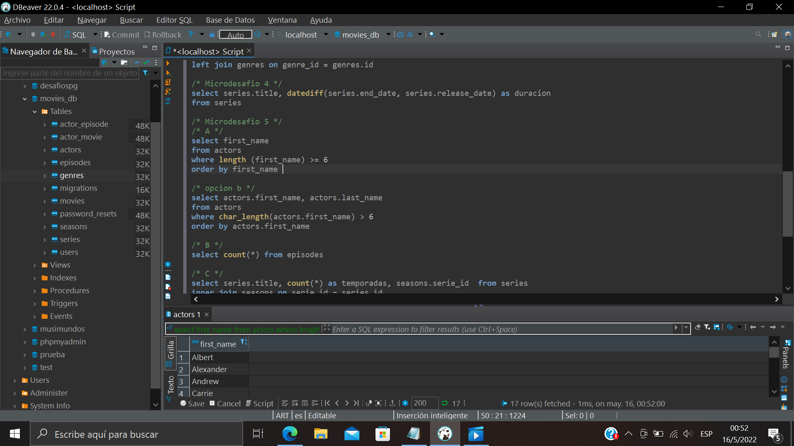

### Uniones y funciones de agregación
#### En esta práctica realizamos diferentes consultas consumiendo datos de difentes tablas de nuestra DB.
#### Ejercitamos con funciones de alteración (concat, inner join, coalesce, datediff, length, char_length...), con funciones de agregación(count, max, min, sum, avg)
